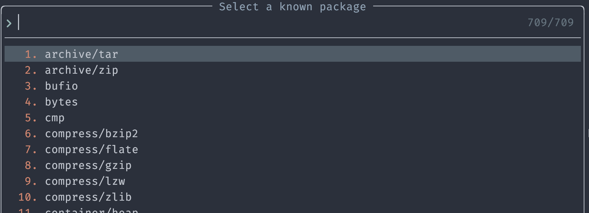
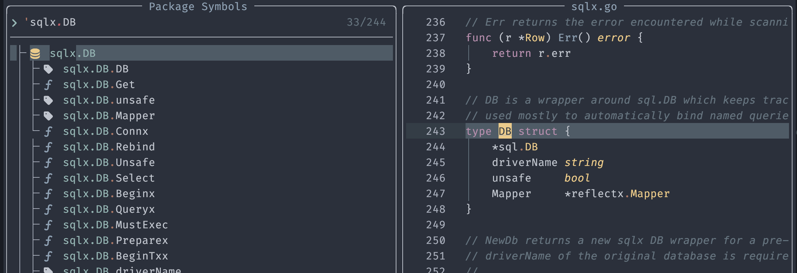

# gopls.nvim

`gopls` exposes many commands via `workspace/executeCommand` which is not readily available through lsp clients. This repo implements a few of them to make your life easier.

## Install 

```lua
  {
    "jackielii/gopls.nvim",
    keys = {
      {
        "<leader>kgl",
        function()
          require("gopls").list_known_packages({with_parent = true, loclist = true})
        end,
        desc = "Gopls list known packages",
      },
      {
        "<leader>kgp",
        function()
          require('gopls.snacks_picker').list_package_symbols({with_parent = true})
        end,
        desc = "Gopls list package symbols",
      },
      {
        "<leader>kgd",
        function()
          require('gopls').doc({show_document = true})
        end,
        desc = "Gopls show documentation",
      },
    }
  }
```

## Features

- [x] gopls.list_known_packages

  

  Upon selecting an item, a new import statement will be inserted

- [x] gopls.package_symbols

  Use `require('gopls').list_package_symbols()` to put the package symbols to location list or quickfix, similar to `:h vim.lsp.buf.document_symbol()`

  Or with [snacks picker](https://github.com/folke/snacks.nvim/blob/main/docs/picker.md) as shown above in the install section:
  

  You're welcome to add support for another picker by sending a PR

- [x] gopls.doc

  Show documentation for the symbol under cursor. If `opts.show_document=true`, it will open a browser window,
  otherwise it will copy the url to clipboard

  As an extension, you can request the symbol doc at pkg.go.dev by setting `show_gopkg = true` in the opts:

  ```lua
  require('gopls').doc({ show_gopkg = true })
  ```

- [x] gopls.tidy

  Run `go mod tidy`.

- [x] gopls.vendor

  Run `go mod vendor`.

- [x] gopls.add_test

  Add a test function for the function under cursor.

- [x] gopls.go_get_package

  Go get a new package. Optionally add require to go.mod and import to the current file.

  ```lua
  function()
    require("gopls").go_get_package({ add_require = true, add_import = true })
  end,

- [x] gopls.diagnose_files

  Run diagnose on files in the current workspace. This is useful when you have external command that changed go files and gopls is unaware of it.

  Example: when a `.templ` file changes, you want to diagnose the `_templ.go` files that are generated.

  ```lua
  vim.api.nvim_create_autocmd("BufWritePost", {
    pattern = "*.templ",
    callback = function(args)
      local templ_file = args.file
      local go_file = templ_file:gsub("%.templ$", "_templ.go")
      require('gopls').diagnose_files(go_file)
    end,
  })
  ```

- [x] gopls.add_import

  Add an import statement to the current file. This is useful to use with other functions like go_get

- [x] gopls.client_open_url

  Request the lsp client to open a URL, if client supports it. This is useful for opening documentation URLs.

- [ ] gopls.add_dependency
- [ ] gopls.add_telemetry_counters
- [ ] gopls.apply_fix
- [ ] gopls.assembly
- [ ] gopls.change_signature
- [ ] gopls.check_upgrades
- [ ] gopls.edit_go_directive
- [ ] gopls.extract_to_new_file
- [ ] gopls.fetch_vulncheck_result
- [ ] gopls.free_symbols
- [ ] gopls.gc_details
- [ ] gopls.generate
- [ ] gopls.list_imports
- [ ] gopls.maybe_prompt_for_telemetry
- [ ] gopls.mem_stats
- [ ] gopls.modify_tags
- [ ] gopls.modules
- [ ] gopls.packages
- [ ] gopls.regenerate_cgo
- [ ] gopls.remove_dependency
- [ ] gopls.reset_go_mod_diagnostics
- [ ] gopls.run_go_work_command
- [ ] gopls.run_govulncheck
- [ ] gopls.run_tests
- [ ] gopls.scan_imports
- [ ] gopls.start_debugging
- [ ] gopls.start_profile
- [ ] gopls.stop_profile
- [ ] gopls.update_go_sum
- [ ] gopls.upgrade_dependency
- [ ] gopls.views
- [ ] gopls.vulncheck
- [ ] gopls.workspace_stats

