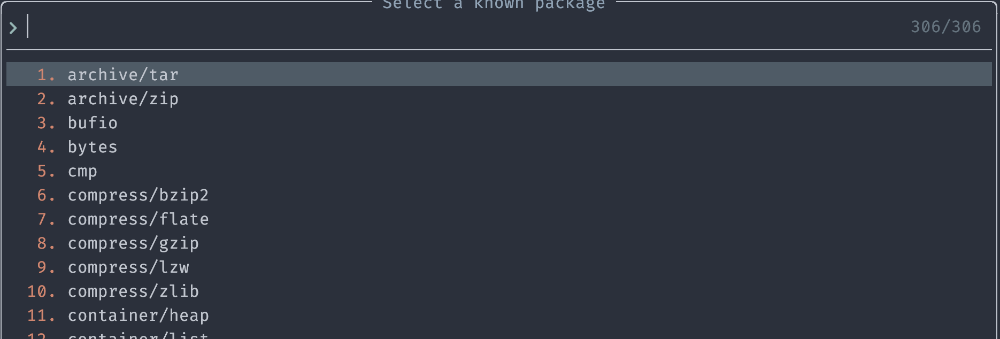

# gopls.nvim
gopls utilities for Neovim

```lua
  {
    "jackielii/gopls.nvim",
    config = true,
    keys = {
      {
        "<leader>kgl",
        function()
          require("gopls").list_known_packages()
        end,
      }
    }
  }
```


Upon selecting an item, a new import statement will be inserted


## Features
- [ ] gopls.list_known_packages
- [ ] gopls.package_symbols


